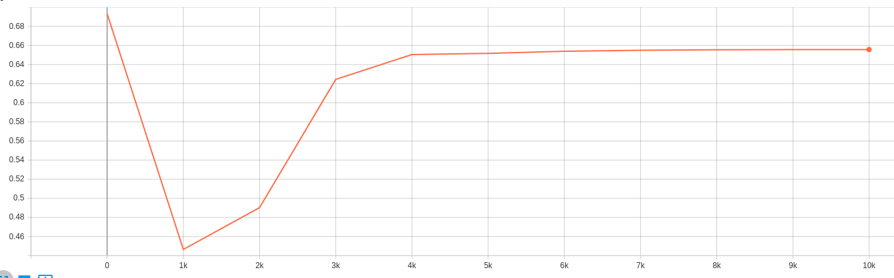
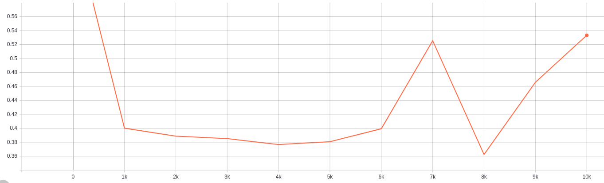
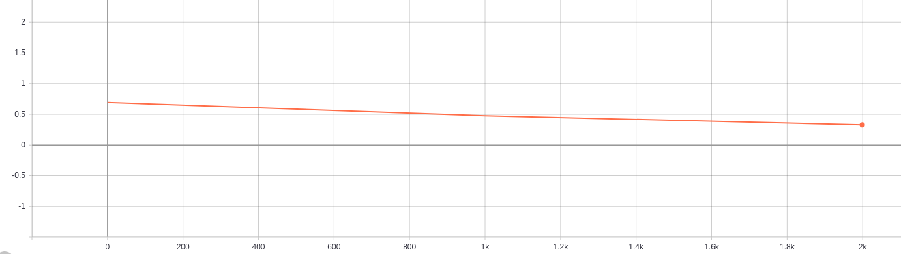

# neural-networks

## About
This is the repository for the implemention of different neural networks from scratch.
## System Dependencies
- Ubuntu 16.04 (Linux)
- Python 3
- TensorboardX
- Scikit Learn
- Matplotlib
## Neural Networks
### Model Architecture: 2-Layer NN with 1 hidden layer
#### Problem Type: Planar Data Classification
#### ---------------------- Training Flower Dataset -------------------------------------------- Test Flower Dataset ----------------------

Classes: Red = 0, Blue = 1

#### Results (Training cost vs Epochs)
1. Epochs: 10000, Hidden layer size: 4, Learning Rate: 1.2, Test Accuracy: 65.5%

2. Epochs: 10000, Hidden layer size: 15, Learning Rate: 1.2, Test Accuracy: 68.75%

3. Epochs: 10000, Hidden layer size: 10, Learning Rate: 1.2, Test Accuracy: 72.25%

4. Epochs: 2000, Hidden layer size: 15, Learning Rate: 1.2, Test Accuracy: 85.25%

# References
- [Coursera - Neural Network and Deep Learning](https://www.coursera.org/learn/neural-networks-deep-learning)
